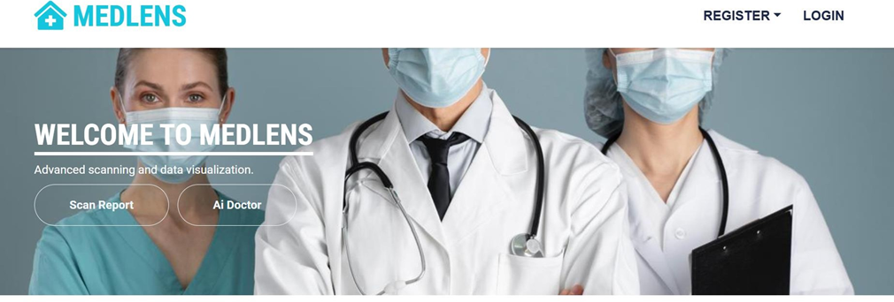
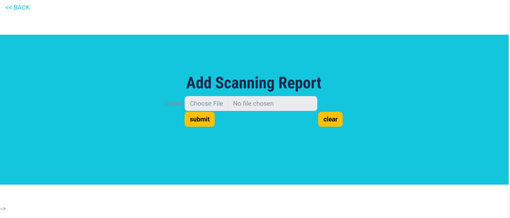
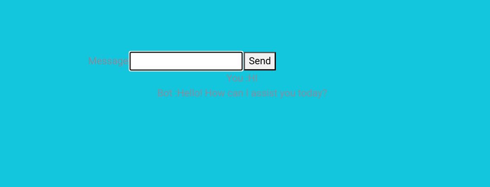
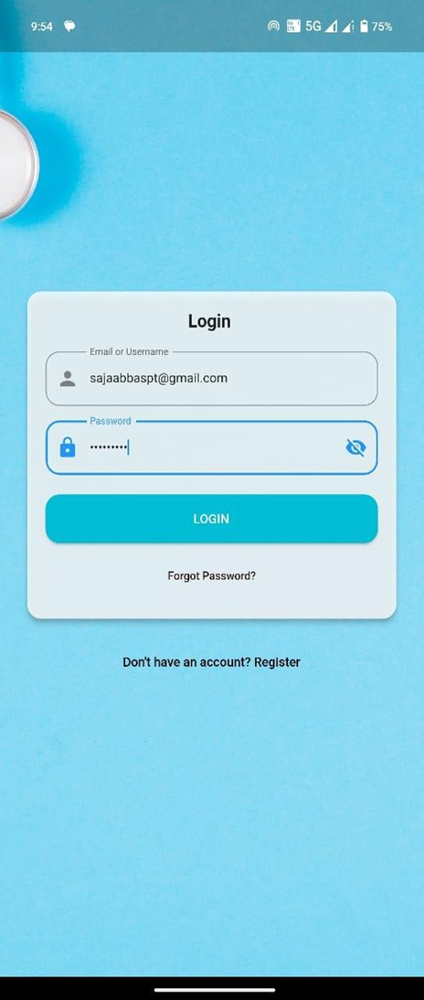

Here is a comprehensive and professional `README.md` file tailored for your final year project, **MedLens**. It is designed to be clear, visually structured, and highlight the technical depth of your work.

---

```markdown
# MedLens 🏥🔍

**MedLens** is an advanced AI-driven medical application developed as a Final Year Degree Project. It is designed to bridge the gap between complex medical data and patient understanding, specifically targeting efficiency in healthcare delivery and management for chronic disease patients.

## 🌟 Overview

MedLens leverages cutting-edge scanning technology and machine learning to transform how patients interact with their health data. By analyzing lab reports and tracking health indicators, the app provides a proactive approach to medical management, diagnosis, and personalized care.

## ✨ Key Features

-   **📄 Smart Lab Report Analysis:** Automatically scans and parses medical lab reports using OCR technology to generate easy-to-understand insights.
-   **🏢 Automated Department Categorization:** Directs patients to the correct medical departments based on their analyzed results.
-   **🥗 Personalized Dietary Recommendations:** Provides AI-driven nutritional advice tailored to the user's specific health conditions and lab outcomes.
-   **🔮 Disease Prediction & Diagnosis:** Analyzes symptoms and tracks long-term health indicators to predict potential risks and assist in early illness diagnosis.
-   **📍 Healthcare Directory:** Locate and select nearby diagnostic labs and specialized doctors based on real-time geolocation.
-   **📈 Continuous Health Monitoring:** Securely upload and store historical reports to track health trends over time.
-   **⏰ Smart Alerts:** Automated reminders for routine check-ups, follow-up tests, and medication.
-   **💬 Feedback Loop:** A dedicated system for users to rate healthcare services and improve the application’s diagnostic accuracy.

## 🛠️ Tech Stack (Example - Customize as needed)

* **Frontend:** Flutter / React Native (Mobile Framework)
* **Backend:** Node.js / Python (FastAPI/Flask)
* **Database:** Firebase / PostgreSQL
* **AI/ML:** Python (Scikit-learn, TensorFlow), Tesseract OCR / Google Vision API
* **Maps:** Google Maps API

## 🚀 Getting Started

### Prerequisites
* List any software needed (e.g., Flutter SDK, Python 3.x, Node.js)

### Installation
1. **Clone the repository:**
   ```bash
   git clone [https://github.com/Saja-abbas/MedLens.git](https://github.com/Saja-abbas/MedLens.git)

```

2. **Navigate to the project directory:**
```bash
cd MedLens

```


3. **Install dependencies:**
```bash
# For Flutter
flutter pub get
# For Backend
pip install -r requirements.txt

```


4. **Run the application:**
```bash
flutter run

```


## 📸 Screenshots

| Home Screen | Report Analysis | Doctor Search |
| :---: | :---: | :---: |
|  |  |  |

| Login Interface |
| :---: |
|  |

## 💡 How It Works

1. **Upload:** User uploads a photo or PDF of a lab report.
2. **Process:** The system extracts data using OCR and identifies key biomarkers (e.g., glucose levels, cholesterol).
3. **Analyze:** ML models compare data against medical standards to predict risks.
4. **Action:** The app suggests a diet, identifies the necessary medical department, and allows the user to book a doctor immediately.

## 🎓 Academic Context

* **Project Title:** MedLens - Advanced Medical Analysis & Management System
* **Level:** Final Year Degree Project
* **Author:** [Saja Abbas](https://www.google.com/search?q=https://github.com/Saja-abbas)


## 📞 Contact

Saja Abbas - sajaabbaspt@gmail.com 
Project Link: [https://github.com/Saja-abbas/MedLens](https://www.google.com/search?q=https://github.com/Saja-abbas/MedLens)

